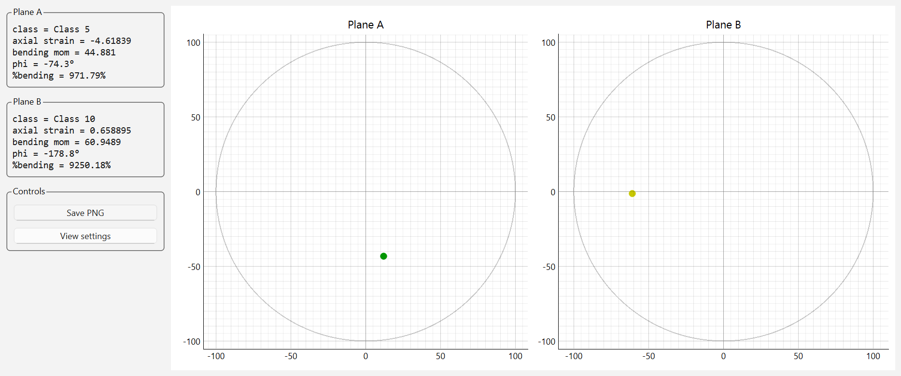
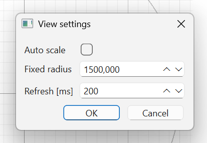

# Alignment Probe – Real-Time ASTM E1012 Bending & Alignment Visualization

## 📌 Introduction

The **Alignment Probe** is a Python application for Windows and Linux for real-time visualization of strain-gauge data from a ME-Systeme **GSV-8** measurement amplifier.
It uses the gsv86lib library (https://github.com/me-systeme/gsv86lib) for native serial communication and provides live evaluation according to ASTM E1012.

It is intended for:

- Mechanical testing laboratories  
- Alignment verification before tensile or compression tests  
- Calibration and setup of test machines  
- R&D involving bending, straightness, or offset analyses  
- Any workflow requiring live strain-gauge–based bending vector visualization  

<figure>
  
  <figcaption>Figure 1: The Alignment Probe main interface.</figcaption>
</figure>

---

## ✨ Features

### 🔧 Real-Time Data Acquisition
- Reads **8 strain gauge channels** at **50 Hz** (default, is configurable)
- Streaming mode using `StartTransmission()`
- Clean device initialization and safe shutdown

### 📈 Live Visualization
- Two polar plots: **Plane A** and **Plane B**
- Real-time bending vector (ε_bx, ε_by)
- Dynamic color coding based on ASTM alignment classes
- Smooth auto-scaling of the bending radius
- Optional fixed-radius mode

### 📊 Alignment Calculations
- Axial strain (ε_ax)  
- Bending strain magnitude (|ε_b|)  
- Bending direction (φ in degrees)  
- Percent bending  
- ASTM alignment class assignment  

### 🖥️ User Interface
- Modern, clean UI layout
- Dedicated info boxes for both planes
- Control panel for PNG export and view-adjustment
- PNG export captures the entire UI (plots + info boxes)

### ⚙️ Configuration Options
- Fully configurable via **YAML**
- Live adjustments through **View Settings** dialog
- External YAML overrides bundled embedded configuration

### 💼 Windows EXE Support
- Can be compiled as a **single-file EXE**
- Includes Python, dependencies and YAML (default)
- No Python installation required on the end-user machine  


---

# 🚀 Getting Started

In order to start up the Alignment Probe you can download a zip file of the repository with the following link: https://github.com/me-systeme/GSV-8lib_AlignmentProbe/archive/refs/heads/main.zip. If you have git installed you can also copy the repository in your working directory with

```bash
git clone https://github.com/me-systeme/GSV-8lib_AlignmentProbe.git
```


## Folder Structure

Make sure your working directory contains:

```yaml
\screenshots
alignment_viewer.py
axial_bending.py
alignment_config.yaml
build_alignment_exe.bat
README.md
```


If built as an EXE, PyInstaller bundles the necessary resources.


## Running from Source

This requires a 64-bit Python and git installation. Install required dependencies:

```bash
pip install pyqtgraph PyQt6 pyyaml numpy
```

```bash 
pip install --upgrade gsv86lib
```

Run the program:
```bash 
python alignment_viewer.py
```

# ⚙️ Configuration

All parameters are stored in:

```yaml
alignment_config.yaml
```

Below is a summary of the most relevant sections.

## Device Settings

```yaml
device:
  #serial_port: "/dev/ttyACM0"   # Linux
  # or
  com_port: 3        # Windows
  baudrate: 230400
  sample_frequency: 50.0    
```

This is an example for the Windows application. If you want to have a Linux application you have to set the `serial_port`:

```yaml
device:
  serial_port: "/dev/ttyACM0"   # Linux
  # or
  #com_port: 3        # Windows
  baudrate: 230400
  sample_frequency: 50.0    
```

## Channel Mapping

Define which strain-gauge channels belong to plane A and plane B:

```yaml
channels:
  section_map:
    A:
      e0: 1
      e90: 2
      e180: 3
      e270: 4
    B:
      e0: 5
      e90: 6
      e180: 7
      e270: 8
```

## GUI / View Settings

```yaml
view:
  auto_scale: true
  fixed_radius: 1500
  refresh_ms: 200
  mult_frames: 1000
```

- auto_scale: enables dynamic radius calculation
- fixed_radius: used when auto_scale = false
- refresh_ms: UI update interval
- mult_frames: number of samples per DLL read (boosts stability)

## Alignment Classes

```yaml
alignment_classes:
  classes_axial_strain_small: [...]
  classes_axial_strain_big:   [...]
  out_of_class: [...]
```

The user may customize bending limits, class colors, and thresholds here.

# 🛠️ Runtime Adjustments (View Settings)

Inside the app, press:

**Controls → View settings**

You can modify:

- Auto-scaling on/off
- Fixed polar radius
- Refresh interval


<figure>
  
  <figcaption>Figure 2: View Settings window.</figcaption>
</figure>

Changes apply immediately without restarting the application.

# 📦 Building a Windows EXE

## 1. Install Packages

```bash
pip install pyinstaller pyqt6 pyqtgraph numpy pyyaml
```
```bash 
pip install --upgrade gsv86lib
```


## 2. Build the EXE

Use this command:
```bash
pyinstaller --onefile --name AlignmentProbe_GSV86LIB ^ --add-data alignment_config.yaml;. alignment_viewer.py
```

Explanation:

- `--onefile` → bundle everything into one executable
- `--add-data file;.` → embed YAML + DLL
- Embedded resources are accessed via `sys._MEIPASS` at runtime

The compiled EXE appears in:

```bash
dist/alignment_viewer.exe
```

Alternatively, the above can be achieved by double-clicking on `build_alignment_exe.bat`.

## 3. Deployment (End User Installation)

You only need to distribute:
```bash
alignment_viewer.exe
```

The EXE already contains:

- Python runtime
- All necessary dependencies
- Default YAML configuration
- Embedded `gsv86lib`

End users **do not** need:

- Python
- pip
- Any third-party libraries

Users may override configuration by placing their own:
```bash
alignment_config.yaml
```

next to the EXE.

#  Linux (Ubuntu) Dependencies for PyQt6

When running the Alignment Probe on Ubuntu or other Debian-based systems, Qt may require several system libraries for the `xcb platform plugin`.

If these packages are missing, you may encounter errors such as:

```lua
qt.qpa.plugin: Could not load the Qt platform plugin "xcb"
```

To install all required system libraries, run:

```bash
sudo apt update
sudo apt install \
    libxcb-cursor0 \
    libxkbcommon-x11-0 \
    libxcb-xinerama0
```

# 🔧 Notes for Developers

- Clean shutdown ensures `StopTransmission()` is always called
- ESC, Ctrl+Q, window close, and Ctrl+C all exit safely
- Heartbeat timer ensures responsive SIGINT handling
- Layout is optimized for balancing info visibility and plot size
- Auto-scale transitions are smoothed for stable visualization
